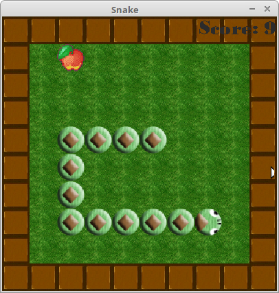
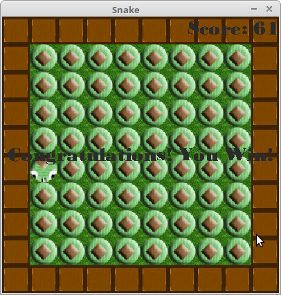
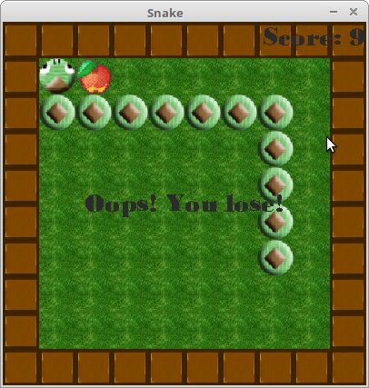

# 贪吃蛇

## 游戏截图

## 代码结构
采用mvp模式，  
[src/presenter/SnakePresenter.cpp](src/presenter/SnakePresenter.cpp)
负责游戏规则逻辑，  
[include/view/SnakeView.h](include/view/SnakeView.h)
视图虚基类的子类负责绘制游戏界面，  
[src/view/SDLView.cpp](src/view/SDLView.cpp)
继承视图类负责SDL绘制游戏界面，  
[src/ai/SnakeAI.cpp](src/ai/SnakeAI.cpp)
负责AI算法，  

## 游戏规则逻辑
地图四周是墙，  
蛇头撞到墙或者蛇身则死亡，游戏失败，  
蛇身填满地图则游戏胜利，  

## 控制
方向键或wsad控制蛇移动方向，  

## AI算法
单纯的哈密顿回路，  
总之就是画出回路然后一直绕，  
